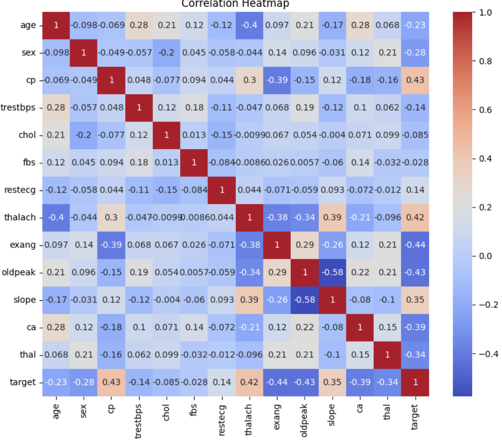

# This_Data_is_Off_the_cHearts
Table of Contents

1. [Introduction](#introduction)
2. [Objective](#objective)
3. [Installation](#installation)
4. [Data Analysis](#data-analysis)
5. [Visualization](#visualization)
6. [Model Comparison](#model-comparison)
7. [Best Models Analysis](#best-models-analysis)
8. [Tableau URL](#tableau-url)
9. [References](#references)

## Introduction

Cardiovascular disease or heart disease describes a range of conditions that affect your heart. Diseases under the heart disease umbrella include blood vessel diseases, such as coronary artery disease. From WHO statistics, every year, 17.9 million die from heart disease

The Cleveland dataset was defined, cleaned, and analyzed to answer pertinent questions that are vital to human life as regards the possibility of a heart attack. This dataset stemmed from a survey donated on 7/1/1988. However, this could serve as a template for learning why individuals could have a heart attack. 

## Objective 

We plan on using the heart attack prediction dataset to create multiple machine learning models. We will then analyze the models based on multiple criteria to find which were the best fit for this data set

## Installation
The packages needed for these models are as follows:

Next, a SQL table was created and the connection was formed through sqlite. This connection was used to read in the Heart data CSV file. 

## Data Analysis

The columns in this data set were age, sex, chest pain, resting blood pressure, cholesterol, fasting blood sugar, rest ecg, max heart rate, exercise induced angina (1 = yes; 0 = no), ST depression on ecg (oldpeak), slope: the slope of the peak exercise ST segment, ca: number of major vessels (0-3) colored by flourosopy, thal: 3 = normal; 6 = fixed defect; 7 = reversable defect and the target value (0 or 1).

Upon analysis in Jupyter notebook found that the data was about a 60/40 split for the target values. And for the sex it was divided into 207 men and 96 women. We also looked into the chest pain distribution, with the highest reported was angina. In the age distribution we saw that the ages were from about 30 to 90, with the peak being around 57-60.

As for the analysis in Tableau, it revealed more of an unbalanced data set. When broken down by target value and gender, we see that 75% of the women sampled have a high chance of heart attack, whereas the men are sampled at about 50/50. Almost 100% of the women sampled with a low chance of heart attack, are in the ranges of age 55-66. Although this may not have directly affected our model accuracy, there is some kind of bias in the data, which in a machine learning model,  could potentially be replicated.

## Visualization

## Model Comparison

In terms of accuracy of the model, random forests and decision trees performed the best.

As for the confusion matrix, where we see the models performance in correctly predicting the 1 and 0 values, random forests and logistic regression performed best. 

Recall and Precision give performance metrics to the confusion matrix. Recall is the true positive rate, foung using the formula: recall= TP/(TP+FN). Precision on the other hand, refers to the proportion of true positive values out of all the predicted vales. Precison uses the formula: Precision= TP/(TP+FP)

In the case of our models, random forests, logistic regression and decision trees were the top performers.

F1 score is a harmonic, balanced mean between the recall and precision scores. Using the formula, F1 Score = 2 * (Precision * Recall) / (Precision + Recall), the F1 score gives a more equal weight to both scores. For our models, again random forrests, logistic regression and decision trees were the top performers.

Despite how promising logistic regression was from the perfomance metrics, its accuracy was never as good as decision tree and random forest. In the end, we chose the decision trees and random forrest as our two models which could best predict the heart attack data!

## Best Models Analysis

In both the Random Forest and the Decision Tree we used 1 as the random state. The data was split into X_train, X_test, y_train, y_test with, x being the data frame and y being the target value, and then scaled using StandardScaler.

For Random Forest, we performed a Random Over Sampler and then converted the data frame into dummies. The scaled and resampled data was then fit into the Random Forest Classifier and resulted in an accuracy score of 80%. The model was then optimized by dropping columns "fbs","restecg" and "sex". This improved the model and resulted in this classification report:

For Decision Tree, we gainedinsight into the decisions the model makes as it lays out all possible outcomes.  
To optimize the accuracy of the model the Fasting Blood Sugar(FBS) column was dropped. The Tree had an accuracy of 75%
Cross Validation was also used to improve the accuracy an additional 5%
 

## Tableau URL
https://public.tableau.com/app/profile/jessica.trusler/viz/dashboard1_16865914825150/Dashboard2
https://public.tableau.com/app/profile/jessica.trusler/viz/comparison_dash/Dashboard1?publish=yes
https://public.tableau.com/app/profile/jessica.trusler/viz/comparison_dash2/Dashboard1?publish=yes
## References
- 2023 edX Boot Camps LLC
- Kaggle dataset (https://www.kaggle.com/datasets/johnsmith88/heart-disease-dataset)
- YouTube
- Stack Overflow
- Jupyter Notebook
- Tableau

